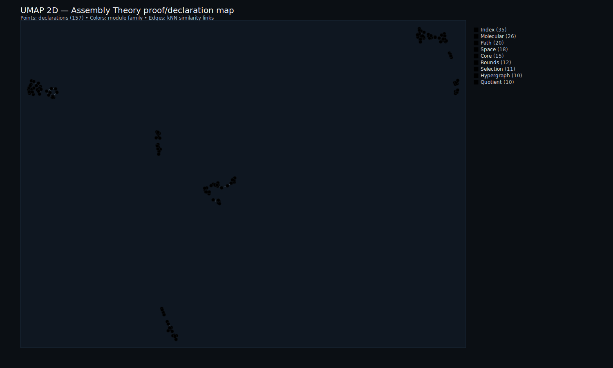
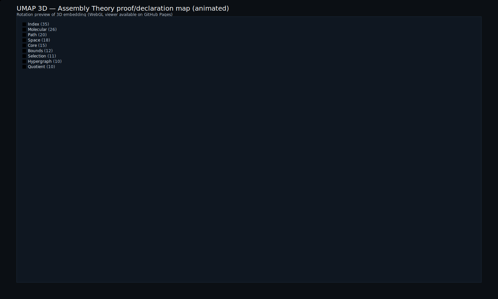

# Assembly Theory Formalization (PaperPack)

<p align="center">
  <strong>Machine-checked formalization of Assembly Theory from "The Physics of Causation"</strong><br/>
  <em>
    Lean 4 proofs of assembly index bounds, reuse-aware path minimization,
    molecular assembly semantics, quotient monotonicity, and selection predicates
  </em>
</p>

<p align="center">
  
  
  
  
</p>

---

Part of the broader HeytingLean formal verification project: https://apoth3osis.io

## TL;DR

- **What:** Machine-checked Lean 4 formalization of Assembly Theory (Walker, Cronin et al., 2024)
- **Verify:** `cd RESEARCHER_BUNDLE && ./scripts/verify_assembly.sh`
- **Main Lean results:** `assemblyIndex_eq_dagJoinCount`, `assemblyIndex_ge_log2`, `assemblyIndex_le_size_sub_one`, `assemblyIndex_quotient_le` (index: `02_Proof_Index.md`)

## Why This Matters (Computational Impact)

Assembly Theory proposes a universal measure of molecular complexity—the **Assembly Index (AI)**—that can distinguish molecules produced by selection (life, technology) from those produced by random chemistry. The claim: molecules with AI > 15 and high abundance are biosignatures.

This PaperPack provides the **first fully mechanized formalization** of Assembly Theory's core mathematics, proving:

1. **AI is well-defined**: The minimum over all assembly pathways exists (via `Nat.find`)
2. **Reuse matters**: AI equals the count of *distinct* join operations, not raw tree size
3. **Tight bounds**: `log₂(size) ≤ AI ≤ size - 1` — these are optimal
4. **Quotient stability**: Identifying equivalent structures cannot *increase* AI
5. **Molecular semantics**: Bonds-as-primitives with vertex superposition is valid

Why this is a big deal:

- **Verification removes doubt**: The mathematical foundations are now machine-checked
- **Reference implementation**: Provides canonical definitions for future work
- **Enables extensions**: Probabilistic bounds, fragmentation algorithms, etc. can build on this
- **Astrobiology relevance**: A verified complexity measure for detecting life

The key insight formalized here: the Assembly Index is exactly the number of *distinct* intermediate products needed to construct an object. Reuse of intermediates reduces complexity—this is why life can build extremely complex molecules while random chemistry cannot.

## Visual Story (One Page)

<table>
  <tr>
    <td align="center" width="50%">
      <strong>2D Proof Map</strong><br/>
      <em>157 declarations across 10 modules</em><br/>
      <a href="https://abraxas1010.github.io/assembly-theory-lean/RESEARCHER_BUNDLE/artifacts/visuals/assembly_2d.html">
        
      </a><br/>
      <a href="https://abraxas1010.github.io/assembly-theory-lean/RESEARCHER_BUNDLE/artifacts/visuals/assembly_2d.html">Open 2D</a>
    </td>
    <td align="center" width="50%">
      <strong>3D Proof Map</strong><br/>
      <em>Animated rotation preview; open for interaction</em><br/>
      <a href="https://abraxas1010.github.io/assembly-theory-lean/RESEARCHER_BUNDLE/artifacts/visuals/assembly_3d.html">
        
      </a><br/>
      <a href="https://abraxas1010.github.io/assembly-theory-lean/RESEARCHER_BUNDLE/artifacts/visuals/assembly_3d.html">Open 3D</a>
    </td>
  </tr>
  <tr>
    <td align="center" width="50%">
      <strong>Assembly Index Bounds</strong><br/>
      <em>Proven tight bounds on AI</em><br/>
      
    </td>
    <td align="center" width="50%">
      <strong>Module Dependencies</strong><br/>
      <em>Core → Path → Index → Bounds → Extensions</em><br/>
      
    </td>
  </tr>
</table>

## Paper Claims → Lean Theorems

| Paper Claim (Walker et al., 2024) | Lean Theorem | File | Status |
|-----------------------------------|--------------|------|--------|
| Assembly Index is well-defined as minimum path length | `assemblyIndex` | AssemblyIndex.lean:26 | **Proved** |
| AI = number of distinct join operations (with reuse) | `assemblyIndex_eq_dagJoinCount` | AssemblyIndex.lean:803 | **Proved** |
| Lower bound: AI ≥ log₂(size) | `assemblyIndex_ge_log2` | AssemblyBounds.lean:145 | **Proved** |
| Upper bound: AI ≤ size - 1 (no reuse) | `assemblyIndex_le_size_sub_one` | AssemblyBounds.lean:63 | **Proved** |
| Primitives have AI = 0 | `assemblyIndex_eq_zero_iff` | AssemblyIndex.lean:42 | **Proved** |
| Quotients preserve/reduce AI | `assemblyIndex_quotient_le` | AssemblyQuotient.lean:153 | **Proved** |
| Molecular assembly with bonds | `assemblyIndex_mol_le_dagJoinCount` | MolecularSpace.lean:278 | **Proved** |
| Selection: high AI + abundance | `selected`, `mono_in_Theta` | CopyNumberSelection.lean:81 | **Proved** |

### Key Theorem Signatures

```lean
-- THE MAIN RESULT: Assembly Index equals reuse-aware join count
theorem assemblyIndex_eq_dagJoinCount [DecidableEq Atom] (o : Obj Atom) :
    AssemblyIndex.assemblyIndex (hC := closed) o = Obj.dagJoinCount o

-- TIGHT BOUNDS
lemma assemblyIndex_ge_log2 (o : Obj α) (ho : Obj.size o > 1) :
    Nat.log 2 (Obj.size o) ≤ assemblyIndex (hC := closed) o

lemma assemblyIndex_le_size_sub_one (o : Obj α) :
    assemblyIndex (hC := closed) o ≤ Obj.size o - 1

-- QUOTIENT MONOTONICITY
lemma assemblyIndex_quotient_le (hC : Closed S) (r : Setoid S.Ω) (z : S.Ω) :
    assemblyIndex (hC := Closed.quotient hC r) (Quotient.mk r z)
      ≤ assemblyIndex (hC := hC) z

-- MOLECULAR ASSEMBLY
lemma assemblyIndex_mol_le_dagJoinCount (o : Obj (Bond Atom)) :
    assemblyIndex (hC := closed) (Quotient.mk evalIsoSetoid o)
      ≤ Obj.dagJoinCount o
```

## What This PaperPack Delivers

- **Core formalization**: Assembly Space `(Ω, U, J)`, paths with reuse, assembly index via `Nat.find`
- **Tight bounds**: `log₂(size) ≤ AI ≤ size - 1` with constructive proofs
- **Equality theorem**: `AI = dagJoinCount` — the index is exactly the distinct join count
- **Quotient theory**: Equivalence relations on objects preserve or reduce AI
- **Molecular extension**: Bonds as unique primitives, vertex-identification joins
- **Hypergraph bridge**: Assembly paths = minimal B-hyperpaths (Flamm-Merkle-Stadler connection)
- **Selection predicates**: Formal definition of "high AI + high abundance"
- **Executable-first QA**: Strict build (`--wfail`), no sorry/admit, standard axioms only

## How To Verify (Local)

```bash
cd RESEARCHER_BUNDLE
./scripts/verify_assembly.sh
```

Or manually:

```bash
cd RESEARCHER_BUNDLE
lake update
lake build -- -DwarningAsError=true
```

This produces verification reports under `RESEARCHER_BUNDLE/reports/`.

## Repository Structure

```
Assembly_PaperPack/
├── README.md                     # This file
├── TECHNICAL_REPORT_FULL.md      # Complete technical report
├── index.html                    # Landing page (GitHub Pages)
├── 01_Lean_Map.md                # Concept → Lean mapping
├── 02_Proof_Index.md             # Theorem/lemma index
├── 03_Reproducibility.md         # Build instructions
├── 04_Dependencies.md            # Version pins
├── artifacts/visuals/            # Visualizations
│   ├── assembly_2d.html          # Interactive 2D UMAP
│   ├── assembly_3d.html          # Interactive 3D UMAP
│   ├── bounds_diagram.svg        # AI bounds illustration
│   └── dependency_graph.svg      # Module dependencies
└── RESEARCHER_BUNDLE/            # Self-contained verification
    ├── lakefile.lean
    ├── lean-toolchain
    ├── scripts/verify_assembly.sh
    └── HeytingLean/ATheory/      # Lean source files
```

## Extensions Beyond the Paper

### Extension 1: Molecular Assembly (Bonds as Primitives)

```lean
structure Bond (Atom : Type u) where
  id : Nat    -- Unique bond instance
  a : Atom    -- First endpoint
  b : Atom    -- Second endpoint

-- Join = disjoint union + vertex identification (superposition)
def MolGraph.identify (G H : MolGraph Atom) (v : G.V) (w : H.V) : MolGraph Atom
```

### Extension 2: B-Hypergraph View

Assembly paths are exactly minimal hyperpaths in directed B-hypergraphs:

```lean
structure BHypergraph.Graph where
  V : Type u
  U : Set V           -- Primitives
  E : V → V → V → Prop -- Binary-source hyperarcs

def hyperIndex (H : Graph) (hC : Closed H) (z : H.V) : Nat :=
  AssemblyIndex.assemblyIndex (S := toAssemblySpace H) z
```

### Extension 3: Computable Bounds

```lean
lemma dagJoinCount_bounds (o : Obj α) (ho : Obj.size o > 1) :
    Nat.log 2 (Obj.size o) ≤ Obj.dagJoinCount o ∧
    Obj.dagJoinCount o ≤ Obj.size o - 1
```

## Axiom Footprint

Standard Lean kernel axioms only:

| Axiom | Purpose |
|-------|---------|
| `propext` | Propositional extensionality |
| `Classical.choice` | Axiom of choice |
| `Quot.sound` | Quotient soundness |

**No project-specific axioms introduced.**

## References

1. Walker, S.I., Mathis, C., Cronin, L., et al. (2024). "The Physics of Causation."

2. Marshall, S.M., et al. (2021). "Identifying molecules as biosignatures with assembly theory and mass spectrometry." *Nature Communications* 12, 3033.

3. Flamm, C., Merkle, D., Stadler, P.F. (2025). "Hyperpaths and assembly theory."

---

<p align="center">
  Part of the <a href="https://apoth3osis.io">HeytingLean</a> formal verification project
</p>
